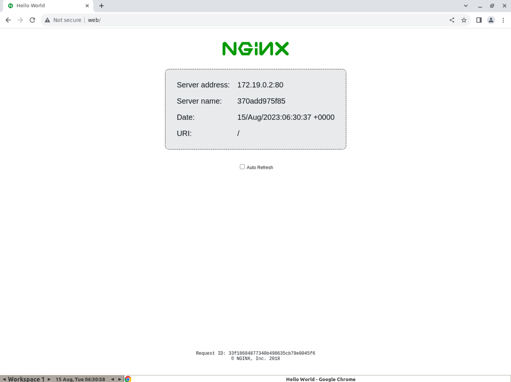

+++
categories = ['Testing']
date = '2023-08-15'
description = 'selenium/standalone-chrome is such a tool that you can use to automate/debug/run your frontend/backend/whatever integration and e2e tests.'
title = 'Local Website Testing with Docker and Selenium'
draft = false
+++


Recently I was building a website that connected to several different APIs. I wanted to test it thoroughly before launch. 

I decided to use Docker to spin everything up locally. That way I could test the whole system end-to-end.

I created a docker-compose file to launch the website and APIs together in a shared network:

```yaml
# docker-compose.yml

version: "3.8"

services:
  web:
    image: myapp
  
  api1:
    image: myapi1

  api2:
    image: myapi2

# etc...
```

This allowed me to test them all together, rather than isolating each API on a different port.

But I still needed a way to simulate browser testing. Enter Selenium!

Selenium is a tool for automating browsers. I used the `selenium/standalone-chrome` docker image. It comes prepacked with:

- Chrome WebDriver
- VNC server

So I could connect directly to the container's Chrome instance via VNC. Perfect for running simulated user tests!

I updated my docker-compose file:

```yaml 
  browser:
    image: selenium/standalone-chrome
    ports:
      - 7900:7900
```

After starting the containers, I could access the Selenium browser at [http://localhost:7900/?autoconnect=1&resize=scale&password=secret](http://localhost:7900/?autoconnect=1&resize=scale&password=secret)





Pretty cool!

This let me thoroughly test the web UI and APIs together, locally and in isolation. No need to fuss with ports or external dependencies.

Docker and Selenium are amazing tools for fast and robust local testing. Give them a spin on your next web project!

Let me know if you have any other tips for testing web UIs and APIs locally.
